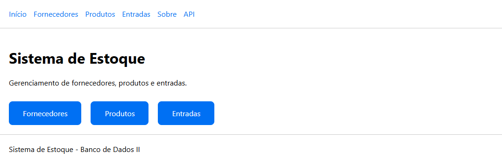
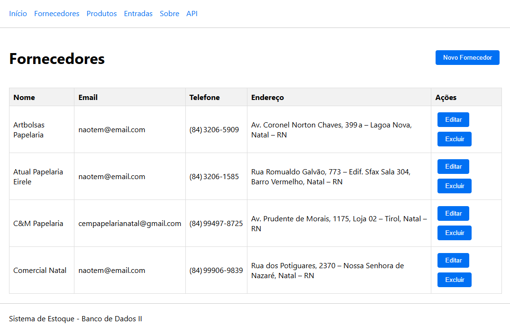
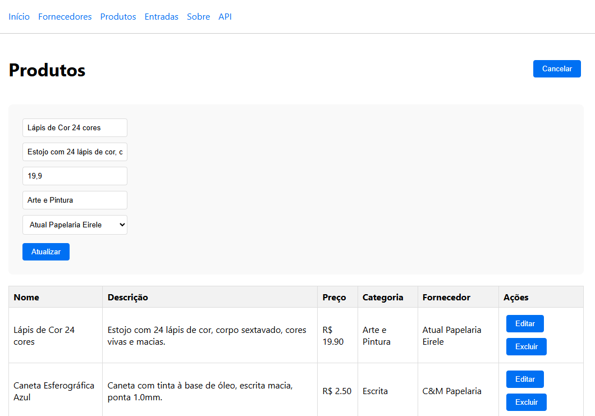
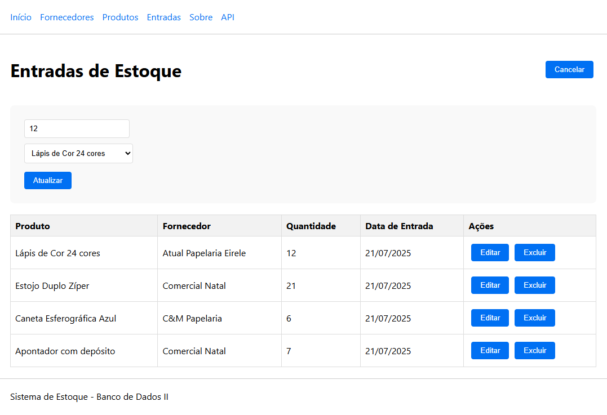
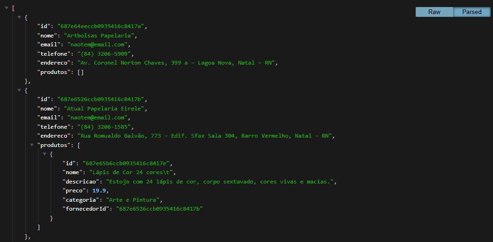

# Sistema de Controle de Estoque

Controle de estoque desenvolvido para a disciplina de Banco de Dados II, implementando operações CRUD com relacionamentos entre entidades usando MongoDB.

## Descrição do Projeto

O sistema permite o gerenciamento completo de um estoque através de três entidades principais:
- **Fornecedores**: Cadastro e gerenciamento de fornecedores
- **Produtos**: Cadastro de produtos vinculados aos fornecedores  
- **Entradas**: Controle de entradas de estoque por produto

## Tecnologias Utilizadas

- **Frontend**: Next.js 15
- **Linguagem**: TypeScript
- **Banco de Dados**: MongoDB
- **ORM**: Prisma
- **Estilização**: CSS

## Funcionalidades

### CRUD Completo
- **Create**: Criar novos registros
- **Read**: Listar e visualizar registros
- **Update**: Editar registros existentes
- **Delete**: Excluir registros

### Relacionamentos
- Produtos vinculados a Fornecedores (N:1)
- Entradas vinculadas a Produtos (N:1)
- Consultas com dados relacionados

### API REST
- Endpoints para todas as entidades
- Operações HTTP (GET, POST, PUT, DELETE)
- Validação de dados

## Pré-requisitos

- Node.js (versão 18 ou superior)
- MongoDB (versão 6.0 ou superior)
- npm ou yarn

## Como instalar e executar

### 1. Clonar o repositório
```bash
git clone https://github.com/alanmartinsdeazevedo/estoque-bd2.git
cd estoque-bd2
```

### 2. Instalar dependências
```bash
npm install
```

### 3. Configurar MongoDB
O MongoDB deve estar rodando localmente na porta padrão (27017).

**No Ubuntu/WSL:**
```bash
# Instalar MongoDB
sudo apt update
sudo apt install -y mongodb-org

# Iniciar MongoDB
sudo systemctl start mongod
sudo systemctl enable mongod
```

### 4. Configurar variáveis de ambiente
O arquivo `.env` está configurado para MongoDB local:
```env
DATABASE_URL="mongodb://localhost:27017/estoque"
```

### 5. Gerar cliente Prisma
```bash
npx prisma generate
```

### 6. Executar o projeto
```bash
npm run dev
```

## Screenshots do Sistema

### Página Inicial


### Gerenciamento de Fornecedores


### Gerenciamento de Produtos


### Controle de Entradas


### API


## Como usar o sistema

### 1. Gerenciar Fornecedores
- Acesse `/fornecedores`
- Cadastre fornecedores com: nome, email, telefone, endereço
- Edite ou exclua fornecedores

### 2. Gerenciar Produtos  
- Acesse `/produtos`
- Cadastre produtos vinculados a fornecedores
- Informe: nome, descrição, preço, categoria
- Edite ou exclua produtos

### 3. Controlar Entradas
- Acesse `/entradas`
- Registre entradas de estoque por produto
- Informe: quantidade e produto
- Edite ou exclua entradas

### 4. API REST
Endpoints da API:
- `GET|POST /api/fornecedores`
- `GET|PUT|DELETE /api/fornecedores/[id]`
- `GET|POST /api/produtos`  
- `GET|PUT|DELETE /api/produtos/[id]`
- `GET|POST /api/entradas`
- `GET|PUT|DELETE /api/entradas/[id]`

## Comandos Disponíveis

```bash
npm run dev        # Executar em desenvolvimento
npm run build      # Build para produção
npm run start      # Executar build de produção
npm run type-check # Verificação de tipos TypeScript
```